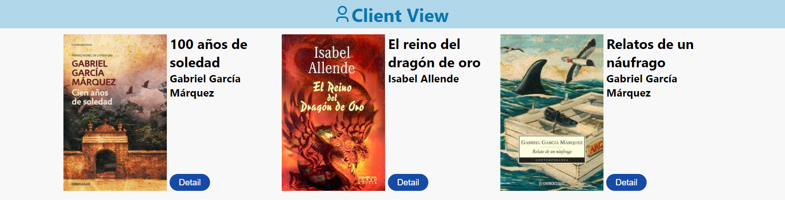

# Avalith Skill Factory React - Checkpoint #3

## Main goal: Develop a responsive library app.

### Requirements:

✅ Create the project using React CRA CLI.

✅ Use Redux Toolkit for state management.

✅ Include CRUD actions: create, read, update and delete books.

✅ Show the following book information: title, author(s), year of publication, cover image, description and ISBN.

✅ Use Responsive Design (either applying Mobile First or Web First).

✅ Use a style library such as Toastify or Sweet Alert.

✅ Use ECMA6 coding style, using functions, destructuring and others.

✅ Implement SCRUM methodology.

✅ Design the UI for the Login and Register

## How did we work?

Since the time we had to develop this app was rather reduced, organization was a key factor for the group, so we implemented the SCRUM methodology. We had dailies in the morning and defined two Sprints. To manage the Product Backlog we chose Trello. Each member of the team was assigned tasks they were required to complete for each sprint. Some members focused on the UI while others worked on the functionality.


## Installation and dependencies

We started the project by creating a react app using

```
npx create-react-app skillfactory-third-project-library-app
```

Then we installed the following dependencies:

• React Redux with

```
npm install react-redux
```

• Redux Toolkit with

```
npm install @reduxjs/toolkit
```

• React Router Dom 6 with

```
npm install react-router-dom@6
```

• React-Toastify with

```npm install react-toastify

```

• uuid with

```
npm install uuid
```

## Developing the app

As the first step, we defined the MVP and designed the UI for our library app. We then created the repository in Github and each member forked the project.


The goal of the first Sprint was to have the CRUD ready, to keep working on improving the UI on the second Sprint.

The members of the team who were focused on the graphics began laying out the app and styling it with CSS. They created components for some sections, such as, the NavBar, the Footer. People working on the functionality had the task to create all necessary book components, their routes, and all slicers and reducers. At this point we also had to define how book IDs would be managed. For this we chose to use uuid. Once the CRUD was ready we started working on form validations using mostly RegEx.
During the second stage, we implemented React-Toastify to show warning, success and error messages in the CRUD actions. We also worked on improving the Responsive UI by adding hamburger buttons and modals.




## How can you use this app?

### 1. Cloning the React App

##### Creating a New Folder

First create a new folder. You can name it whatever you want.

##### Getting the Code URL

In the React app's GitHub repo, click on the button, Code. A drop down will appear where you can copy the code URL.

##### Cloning the React app's GitHub Repo

Now, open the git bash window for the new folder you just created by right clicking on the folder and clicking Git bash here.
On your git bash window, type `git clone`, paste the code URL of the GitHub repo, then run the command by pressing enter.

```
git clone https://github.com/hernandw/skillfactory-third-project-library-app.git
```

At the end of the process, if you did everything correctly, you won't encounter any errors meaning the cloning process was completed successfully.

### 2. Configuring the Cloned App

Once you’ve completed the previous step, you need to create your own `package-lock.json` file and `node_modules` folder. You don’t need to manually create these, as the following commands we run will create them.
Press `ctrl + j` on Windows or `command + j` on Mac to open your terminal on VSCode.
On your terminal, change your directory to the name of the cloned folder.
Let’s say the cloned folder name is ‘my-cloned-app’
`cd my-cloned-app`
Once that is done successfully, you need to run

```
npm install
```

This will take some time to finish running.
If you did everything correctly, at the end of the process, you will see words along these lines on your terminal.

### 3. Starting the React app

So, run `npm start` on your terminal.
Make sure you are in the right directory before running this command to avoid errors.
If you are not or if you are not sure you are, cd to the right directory.
Once the command is done running, your React app will open on your local host on your default browser.
`https:// localhost:3000`
_Congratulations, you've successfully cloned and started your React app._

## Team

<div style="display:flex;justify-content:space-around;text-align:center;font-weight:bold"><div><p>Flor</p></div> <div><p>Guardini</p></div><div><p>Javi</p></div><div><p>Will</p></div></div>

## Demo

If you want to see the demo of this proyect deployed, you can visit [https://skillfactory-third-project.netlify.app](https://skillfactory-third-project.netlify.app)
